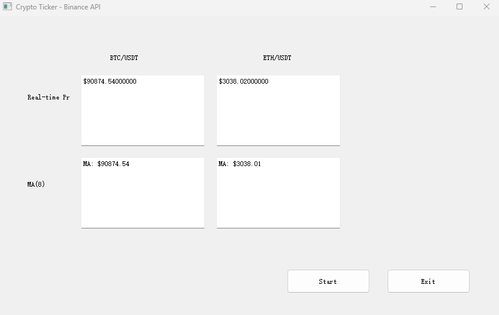

# Cryptocurrency Real-time Ticker

A PyQt5-based desktop application for real-time cryptocurrency price monitoring. Fetches live BTC and ETH prices from Binance API and calculates 8-period moving averages.



## Features

- Real-time price monitoring for BTC/USDT and ETH/USDT
- Automated 8-period moving average (MA8) calculation
- Clean PyQt5 GUI with live updates
- Efficient sliding window algorithm using Python deque

## Tech Stack

- **Python 3.6+**
- **PyQt5** - GUI framework
- **NumPy** - Data processing
- **Binance API** - Real-time price data (public, no auth required)

## Installation

```bash
# Clone repository
git clone https://github.com/yourusername/crypto-ticker.git
cd crypto-ticker

# Install dependencies
pip install -r requirements.txt
```

## Usage

```bash
cd src
python main.py
```

Click **Start** to begin monitoring, **Exit** to close.

## Project Structure

```
crypto-ticker/
├── src/
│   ├── main.py           # Application entry point
│   ├── data_fetcher.py   # Binance API client
│   ├── data_processor.py # Moving average calculator
│   ├── ui_layout.py      # UI components
│   └── interface.ui      # Qt Designer file
├── assets/
│   └── screenshot.png
├── requirements.txt
└── README.md
```

## How It Works

**Data Flow:**
```
Binance API → data_fetcher → data_processor (MA calculation) → main (UI updates)
```

**Moving Average Algorithm:**
- Uses a sliding window (deque) of size 8
- O(1) insertion/deletion, O(n) average calculation where n=8
- Filters duplicate data by timestamp

## API Information

**Endpoint:** `https://api.binance.com/api/v3/ticker/price?symbol=BTCUSDT`

**Supported symbols:** BTC, ETH, LTC, BNB, XRP

**Rate limit:** 1200 requests/minute

## Requirements

- Python 3.6+
- PyQt5 >= 5.10.0
- NumPy >= 1.19.0
- Internet connection

## License

MIT License

---

⭐ **Star this repo if you find it helpful!**
